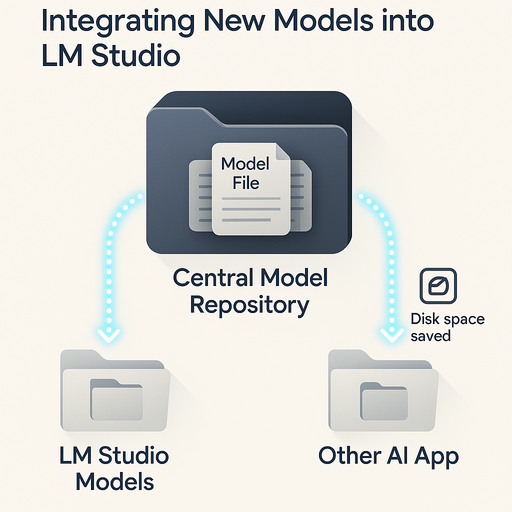
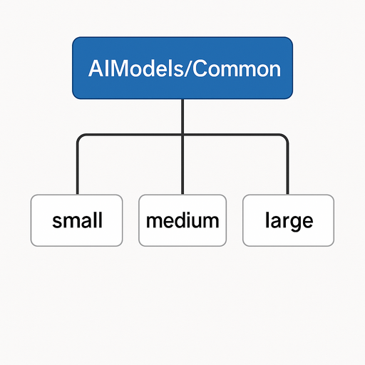
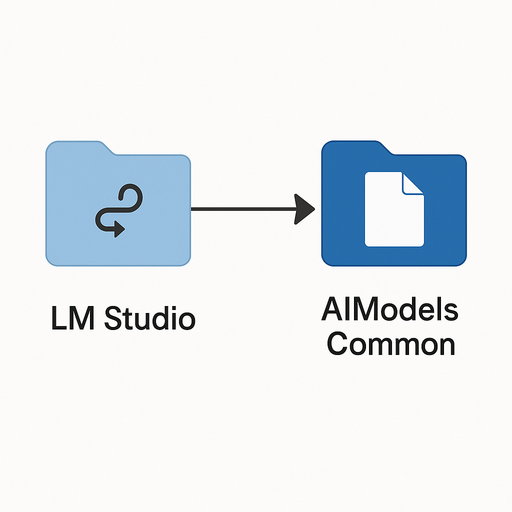
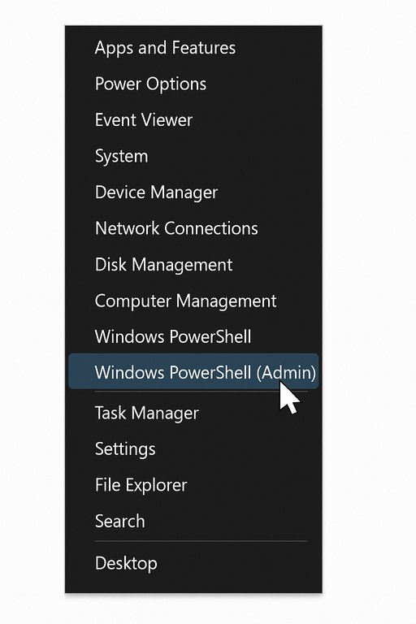
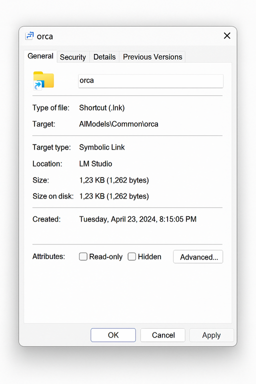

# LM Studio Integration Guide: Central Model Management with Symlinks 🚀
This guide explains how to integrate new models into LM Studio by organizing model files in a centralized directory structure and creating symbolic links (symlinks) in the LM Studio model directories. This method helps save disk space and simplifies model management, especially if you use models across multiple AI applications.

---
Select your language below:
<details>
<summary>🇩🇪 Deutsch</summary>

---
# LM Studio Integration Guide: Zentrales Modellmanagement mit Symlinks 🚀



Diese Anleitung erklärt, wie du neue Modelle in LM Studio integrierst, indem du Modelldateien in einer zentralisierten Verzeichnisstruktur organisierst und symbolische Links (Symlinks) in den LM Studio Modellverzeichnissen erstellst. Diese Methode hilft, Speicherplatz zu sparen und die Modellverwaltung zu vereinfachen, besonders wenn du Modelle über mehrere KI-Anwendungen hinweg nutzt.

## Inhalt
- [1. Verzeichnisstruktur](#1-verzeichnisstruktur)
  - [Zentraler Modellspeicher](#zentraler-modellspeicher)
  - [LM Studio Verzeichnisstruktur](#lm-studio-verzeichnisstruktur)
- [2. Manuelle Integrationsschritte](#2-manuelle-integrationsschritte)
- [3. PowerShell-Skript zur Automatisierung](#3-powershell-skript-zur-automatisierung)
- [4. Administratorrechte erforderlich ⚠️](#4-administratorrechte-erforderlich-%EF%B8%8F)
- [5. Nutzungsanweisungen & Beispiele](#5-nutzungsanweisungen--beispiele)
  - [Beispiel 1: Einzelnes Modell hinzufügen](#beispiel-1-einzelnes-modell-hinzufügen)
  - [Beispiel 2: Andere Kategorie verwenden](#beispiel-2-andere-kategorie-verwenden)
  - [Beispiel 3: Batch-Verarbeitung mehrerer Modelle](#beispiel-3-batch-verarbeitung-mehrerer-modelle)
- [6. Tipps & Fehlerbehebung 💡](#6-tipps--fehlerbehebung-%EF%B8%8F)
- [7. Vorteile der Nutzung von Symlinks ✅](#7-vorteile-der-nutzung-von-symlinks-%E2%9C%85)


## 1. Verzeichnisstruktur
Die Kernidee ist, deine Modelldateien an einem zentralen Ort zu speichern und LM Studio (und potenziell andere Anwendungen) mittels symbolischer Links auf diese Dateien \"zeigen\" zu lassen.
### Zentraler Modellspeicher
Wir empfehlen einen zentralen Ordner, zum Beispiel:
`C:\\AIModels\\Common\\`
Innerhalb dessen kannst du Modelle nach Größe oder anderen Kriterien organisieren:
*   `C:\\AIModels\\Common\\`
    *   `small\\` (Für Modelle unter 2GB)
    *   `medium\\` (Für Modelle 2-8GB)
    *   `large\\` (Für Modelle über 8GB)



### LM Studio Verzeichnisstruktur
LM Studio speichert Modelle typischerweise hier:
`C:\\Users\\{Benutzername}\\AppData\\Roaming\\LM Studio\\models\\`
Innerhalb dessen werden Modelle oft so kategorisiert:
*   `C:\\Users\\{Benutzername}\\AppData\\Roaming\\LM Studio\\models\\`
    *   `lmstudio-community\\` (Für Community-Modelle)
    *   `hugging-quants\\` (Für Hugging Face/TheBloke Modelle)

Das Ziel ist, *Symlinks* in den Ordnern `lmstudio-community` oder `hugging-quants` zu platzieren, die auf die eigentlichen Modelldateien in `C:\\AIModels\\Common\\` zeigen.



## 2. Manuelle Integrationsschritte
Um ein Modell manuell mit dieser Methode in LM Studio zu integrieren:
1.  **Modell speichern:** Stelle sicher, dass die Modelldatei (z.B. `modell-name.gguf`) an deinem zentralen Speicherort existiert (z.B. `C:\\AIModels\\Common\\medium\\modell-name.gguf`).
2.  **LM Studio Verzeichnisse erstellen (falls nötig):** Stelle sicher, dass der Ziel-Unterordner von LM Studio (z.B. `lmstudio-community`) innerhalb von `C:\\Users\\{Benutzername}\\AppData\\Roaming\\LM Studio\\models\\` existiert.
3.  **Symbolischen Link erstellen:**
    Öffne **PowerShell als Administrator** (siehe [Abschnitt 4](#4-administratorrechte-erforderlich-%EF%B8%8F)) und führe aus:
```powershell
New-Item -ItemType SymbolicLink -Path \"C:\\Users\\{Benutzername}\\AppData\\Roaming\\LM Studio\\models\\lmstudio-community\\modell-name.gguf\" -Target \"C:\\AIModels\\Common\\medium\\modell-name.gguf\"
```
    *   Ersetze `{Benutzername}` mit deinem Windows-Benutzernamen.
    *   Passe `-Path` (Ort und Name des Symlinks) und `-Target` (Ort und Name der Originaldatei) bei Bedarf an.

## 3. PowerShell-Skript zur Automatisierung
Um das Erstellen von Symlinks zu vereinfachen, kannst du die folgende PowerShell-Funktion verwenden. Füge diese Funktion deinem PowerShell-Profil (`$PROFILE`) hinzu oder speichere sie als `.ps1`-Skript, um sie auszuführen.
```powershell
function Add-ModelSymlink {
    param (
        [Parameter(Mandatory=$true)]
        [string]$ModelName,
        [Parameter(Mandatory=$true)]
        [string]$SourcePath,
        [Parameter(Mandatory=$false)]
        [ValidateSet(\"lmstudio-community\", \"hugging-quants\")]
        [string]$Category = \"lmstudio-community\",
        [Parameter(Mandatory=$false)]
        [string]$Username = $env:USERNAME
    )
    if (-not (Test-Path -Path $SourcePath)) {
        Write-Error \"Quelldatei nicht gefunden: $SourcePath\"
        return
    }
    $lmStudioModelsPath = \"C:\\Users\\$Username\\AppData\\Roaming\\LM Studio\\models\\$Category\"
    if (-not (Test-Path -Path $lmStudioModelsPath)) {
        New-Item -ItemType Directory -Path $lmStudioModelsPath -Force
        Write-Host \"Verzeichnis erstellt: $lmStudioModelsPath\"
    }
    $targetPath = Join-Path -Path $lmStudioModelsPath -ChildPath $ModelName
    try {
        New-Item -ItemType SymbolicLink -Path $targetPath -Target $SourcePath -Force
        Write-Host \"Symlink für $ModelName erfolgreich erstellt.\"
    }
    catch {
        Write-Error \"Fehler beim Erstellen des Symlinks: $_\"
    }
}
```

## 4. Administratorrechte erforderlich ⚠️
Das Erstellen von symbolischen Links in Windows **erfordert Administratorrechte**.
So startest du PowerShell als Administrator:
1.  Drücke `Win + X`.
2.  Wähle \"Windows PowerShell (Administrator)\" oder \"Terminal (Admin)\".
3.  Klicke im UAC-Dialog (Benutzerkontensteuerung) auf \"Ja\". Alternativ suche im Startmenü nach \"PowerShell\", klicke mit der rechten Maustaste auf \"Windows PowerShell\" und wähle \"Als Administrator ausführen\".



## 5. Nutzungsanweisungen & Beispiele
Sobald du die Funktion `Add-ModelSymlink` in deiner Administrator-PowerShell-Sitzung geladen hast:
### Beispiel 1: Einzelnes Modell hinzufügen
```powershell
# PowerShell als Administrator ausführen
Add-ModelSymlink -ModelName \"llama3-8b-instruct.Q5_K_M.gguf\" `
                 -SourcePath \"C:\\AIModels\\Common\\medium\\llama3-8b-instruct.Q5_K_M.gguf\" `
                 -Category \"lmstudio-community\"
```
### Beispiel 2: Andere Kategorie verwenden
```powershell
Add-ModelSymlink -ModelName \"mistral-7b-instruct.Q5_K_M.gguf\" `
                 -SourcePath \"C:\\AIModels\\Common\\medium\\mistral-7b-instruct.Q5_K_M.gguf\" `
                 -Category \"hugging-quants\"
```
### Beispiel 3: Batch-Verarbeitung mehrerer Modelle
```powershell
$models = @(
    @{
        ModelName = \"llama3-8b-instruct.Q5_K_M.gguf\"
        SourcePath = \"C:\\AIModels\\Common\\medium\\llama3-8b-instruct.Q5_K_M.gguf\"
        Category = \"lmstudio-community\"
    },
    @{
        ModelName = \"mistral-7b-instruct.Q5_K_M.gguf\"
        SourcePath = \"C:\\AIModels\\Common\\medium\\mistral-7b-instruct.Q5_K_M.gguf\"
        Category = \"hugging-quants\"
    },",
    @{",
        ModelName = \"phi3-mini-instruct.Q4_K_M.gguf\"",
        SourcePath = \"C:\\AIModels\\Common\\small\\phi3-mini-instruct.Q4_K_M.gguf\"
        Category = \"lmstudio-community\"
    }
)
foreach ($model in $models) {
    Add-ModelSymlink @model
}
```

## 6. Tipps & Fehlerbehebung 💡
*   **Administratorrechte:** Stelle immer sicher, dass PowerShell als Administrator ausgeführt wird.
*   **LM Studio neu starten:** Nach dem Hinzufügen von Symlinks LM Studio neu starten.
*   **Verschieben der Quelldateien:** Symlinks werden ungültig, wenn Quelldateien verschoben werden.
*   **Symlink überprüfen:** Im Explorer (Pfeil-Overlay) und Eigenschaften (Typ: Symbolische Verknüpfung, Zielpfad).


*   **Modelle löschen (in LM Studio):** Entfernt nur den Symlink, nicht die Originaldatei.
*   **Pfadexistenz:** Überprüfe Quell- und Zielpfade.

## 7. Vorteile der Nutzung von Symlinks ✅
*   💾 **Festplattenspeicher sparen**
*   🗂️ **Zentralisierte Verwaltung**
*   🔄 **Anwendungsübergreifende Nutzung**
*   📦 **Vereinfachte Backups**
</details>
<details open>
<summary>🇬🇧 English</summary>

---
# LM Studio Integration Guide: Central Model Management with Symlinks 🚀


This guide explains how to integrate new models into LM Studio by organizing model files in a centralized directory structure and creating symbolic links (symlinks) in the LM Studio model directories. This method helps save disk space and simplifies model management, especially if you use models across multiple AI applications.

## Table of Contents
- [1. Directory Structure](#1-directory-structure)
  - [Central Model Storage](#central-model-storage)
  - [LM Studio Directory Structure](#lm-studio-directory-structure)
- [2. Manual Integration Steps](#2-manual-integration-steps)
- [3. PowerShell Script for Automation](#3-powershell-script-for-automation)
- [4. Administrator Rights Required ⚠️](#4-administrator-rights-required-%ef%b8%8f)
- [5. Usage Instructions & Examples](#5-usage-instructions--examples)
  - [Example 1: Add a Single Model](#example-1-add-a-single-model)
  - [Example 2: Use a Different Category](#example-2-use-a-different-category)
  - [Example 3: Batch Processing Multiple Models](#example-3-batch-processing-multiple-models)
- [6. Tips & Troubleshooting 💡](#6-tips--troubleshooting-%ef%b8%8f)
- [7. Benefits of Using Symlinks ✅](#7-benefits-of-using-symlinks-%e2%9c%85)

## 1. Directory Structure
The core idea is to store your model files in a central location and have LM Studio (and potentially other applications) \"point\" to these files using symbolic links (symlinks).
### Central Model Storage
We recommend a central folder, for example:
`C:\\AIModels\\Common\\`
Within this, you can organize models by size or other criteria:
*   `C:\\AIModels\\Common\\`
    *   `small\\` (For models under 2GB)
    *   `medium\\` (For models 2-8GB)
    *   `large\\` (For models over 8GB)


### LM Studio Directory Structure
LM Studio typically stores models here:
`C:\\Users\\{Username}\\AppData\\Roaming\\LM Studio\\models\\`
Within this, models are often categorized like this:
*   `C:\\Users\\{Username}\\AppData\\Roaming\\LM Studio\\models\\`
    *   `lmstudio-community\\` (For community models)
    *   `hugging-quants\\` (For Hugging Face/TheBloke models)

The goal is to place *symlinks* in the `lmstudio-community` or `hugging-quants` folders that point to the actual model files in `C:\\AIModels\\Common\\`


## 2. Manual Integration Steps
To manually integrate a model using this method into LM Studio:
1.  **Store the model:** Ensure the model file (e.g., `model-name.gguf`) exists in your central storage location (e.g., `C:\\AIModels\\Common\\medium\\model-name.gguf`).
2.  **Create LM Studio directories (if necessary):** Ensure the target subfolder within LM Studio (e.g., `lmstudio-community`) exists inside `C:\\Users\\{Username}\\AppData\\Roaming\\LM Studio\\models\\`.
3.  **Create the symbolic link:**
    Open **PowerShell as Administrator** (see [Section 4](#4-administrator-rights-required-%ef%b8%8f)) and run:
```powershell
New-Item -ItemType SymbolicLink -Path \"C:\\Users\\{Username}\\AppData\\Roaming\\LM Studio\\models\\lmstudio-community\\model-name.gguf\" -Target \"C:\\AIModels\\Common\\medium\\model-name.gguf\"
```
    *   Replace `{Username}` with your Windows username.
    *   Adjust `-Path` (location and name of the symlink) and `-Target` (location and name of the original file) as needed.

## 3. PowerShell Script for Automation
To simplify the creation of symlinks, you can use the following PowerShell function. Add this function to your PowerShell profile (`$PROFILE`) or save it as a `.ps1` script to run it.
```powershell
function Add-ModelSymlink {
    param (
        [Parameter(Mandatory=$true)]
        [string]$ModelName,
        [Parameter(Mandatory=$true)]
        [string]$SourcePath,
        [Parameter(Mandatory=$false)]
        [ValidateSet(\"lmstudio-community\", \"hugging-quants\")]
        [string]$Category = \"lmstudio-community\",
        [Parameter(Mandatory=$false)]
        [string]$Username = $env:USERNAME
    )
    if (-not (Test-Path -Path $SourcePath)) {
        Write-Error \"Source file not found: $SourcePath\"
        return
    }
    $lmStudioModelsPath = \"C:\\Users\\$Username\\AppData\\Roaming\\LM Studio\\models\\$Category\"
    if (-not (Test-Path -Path $lmStudioModelsPath)) {
        New-Item -ItemType Directory -Path $lmStudioModelsPath -Force
        Write-Host \"Directory created: $lmStudioModelsPath\"
    }
    $targetPath = Join-Path -Path $lmStudioModelsPath -ChildPath $ModelName
    try {
        New-Item -ItemType SymbolicLink -Path $targetPath -Target $SourcePath -Force
        Write-Host \"Symlink for $ModelName created successfully.\"
    }
    catch {
        Write-Error \"Error creating symlink: $_\"
    }
}
```

## 4. Administrator Rights Required ⚠️
Creating symbolic links in Windows **requires administrator rights**.
How to start PowerShell as Administrator:
1.  Press `Win + X`.
2.  Select \"Windows PowerShell (Administrator)\" or \"Terminal (Admin)\".
3.  Click \"Yes\" in the UAC (User Account Control) dialog. Alternatively, search for \"PowerShell\" in the Start menu, right-click on \"Windows PowerShell\", and select \"Run as administrator\".


## 5. Usage Instructions & Examples
Once you have loaded the `Add-ModelSymlink` function in your Administrator PowerShell session:
### Example 1: Add a Single Model
```powershell
# Run PowerShell as Administrator
Add-ModelSymlink -ModelName \"llama3-8b-instruct.Q5_K_M.gguf\" `
                 -SourcePath \"C:\\AIModels\\Common\\medium\\llama3-8b-instruct.Q5_K_M.gguf\" `
                 -Category \"lmstudio-community\"
```
### Example 2: Use a Different Category
```powershell
Add-ModelSymlink -ModelName \"mistral-7b-instruct.Q5_K_M.gguf\" `
                 -SourcePath \"C:\\AIModels\\Common\\medium\\mistral-7b-instruct.Q5_K_M.gguf\" `
                 -Category \"hugging-quants\"
```
### Example 3: Batch Processing Multiple Models
```powershell
$models = @(
    @{
        ModelName = \"llama3-8b-instruct.Q5_K_M.gguf\"
        SourcePath = \"C:\\AIModels\\Common\\medium\\llama3-8b-instruct.Q5_K_M.gguf\"
        Category = \"lmstudio-community\"
    },
    @{
        ModelName = \"mistral-7b-instruct.Q5_K_M.gguf\"
        SourcePath = \"C:\\AIModels\\Common\\medium\\mistral-7b-instruct.Q5_K_M.gguf\"
        Category = \"hugging-quants\"
    },
    @{
        ModelName = \"phi3-mini-instruct.Q4_K_M.gguf\"
        SourcePath = \"C:\\AIModels\\Common\\small\\phi3-mini-instruct.Q4_K_M.gguf\"
        Category = \"lmstudio-community\"
    }
)
foreach ($model in $models) {
    Add-ModelSymlink @model
}
```

## 6. Tips & Troubleshooting 💡
*   **Administrator Rights:** Always ensure PowerShell is run as Administrator.
*   **Restart LM Studio:** Restart LM Studio after adding symlinks.
*   **Moving Source Files:** Symlinks become invalid if source files are moved.
*   **Check Symlink:** In Explorer (arrow overlay) and Properties (Type: Symbolic link, Target path).

*   **Deleting Models (in LM Studio):** Only removes the symlink, not the original file.
*   **Path Existence:** Verify source and target paths exist.

## 7. Benefits of Using Symlinks ✅
*   💾 **Save Disk Space**
*   🗂️ **Centralized Management**
*   🔄 **Cross-Application Usage**
*   📦 **Simplified Backups**
</details>
</details>