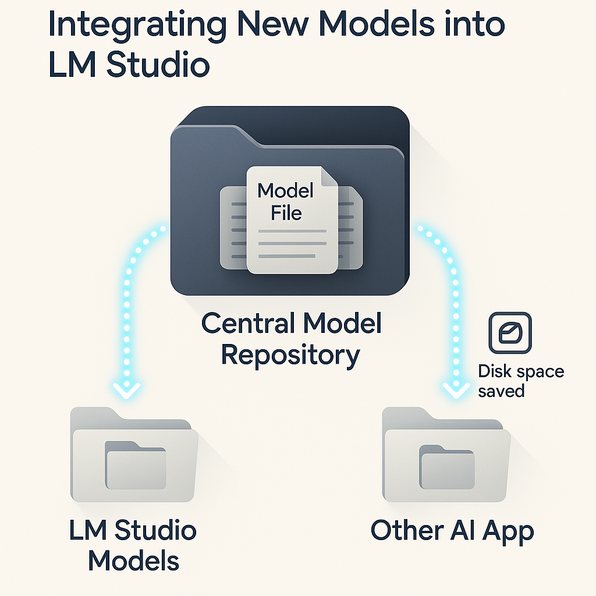
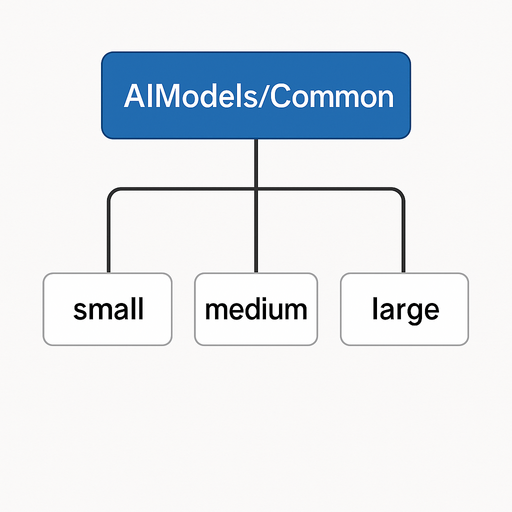
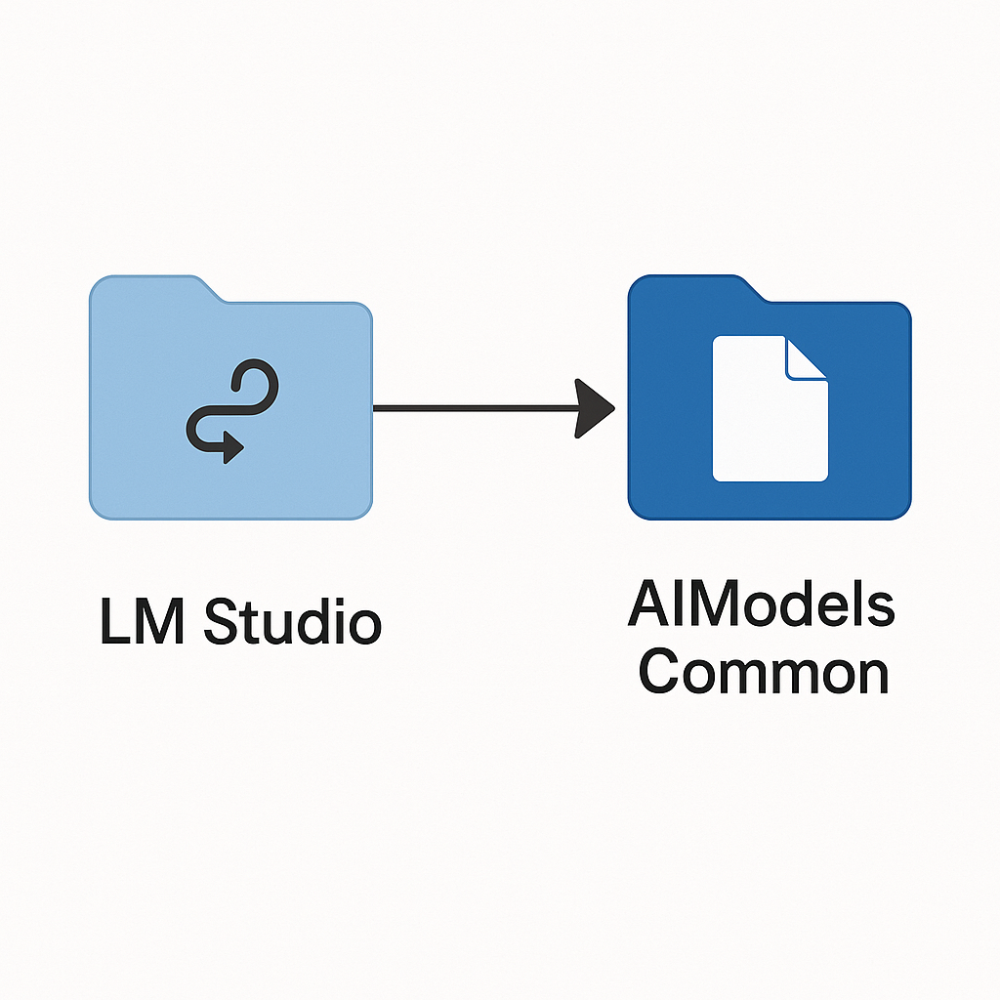
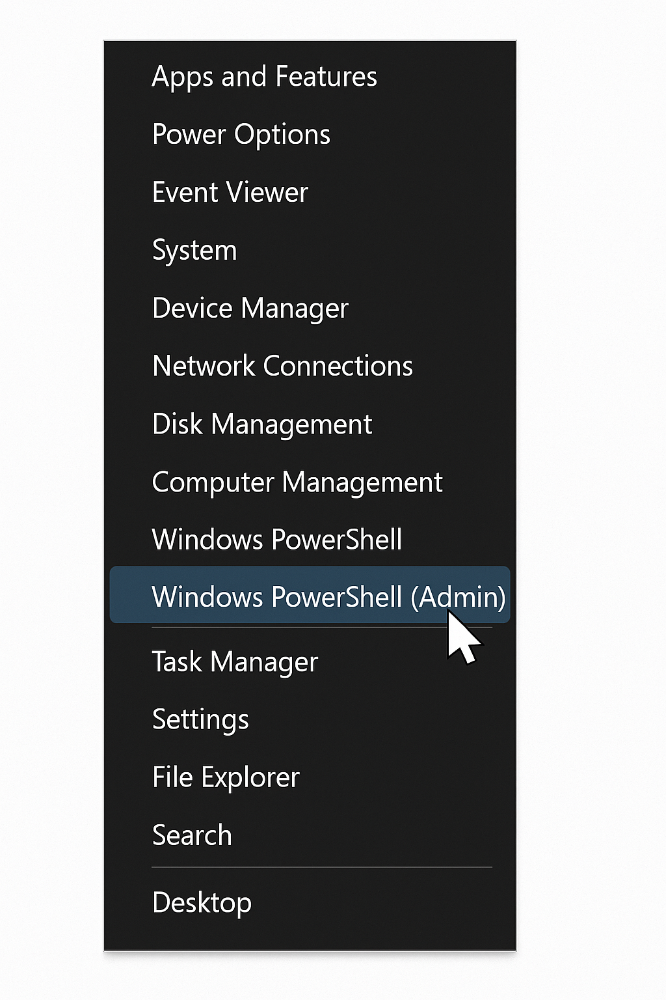
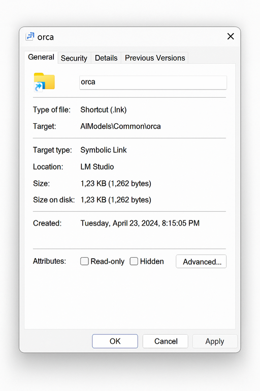

# LM Studio Integration Guide: Zentrales Modellmanagement mit Symlinks 🚀 (Deutsch)


Diese Anleitung erklärt, wie du neue Modelle in LM Studio integrierst, indem du Modelldateien in einer zentralisierten Verzeichnisstruktur organisierst und symbolische Links (Symlinks) in den LM Studio Modellverzeichnissen erstellst. Diese Methode hilft, Speicherplatz zu sparen und die Modellverwaltung zu vereinfachen, besonders wenn du Modelle über mehrere KI-Anwendungen hinweg nutzt.

---

## Inhalt

- [1. Verzeichnisstruktur](#1-verzeichnisstruktur)
  - [Zentraler Modellspeicher](#zentraler-modellspeicher)
  - [LM Studio Verzeichnisstruktur](#lm-studio-verzeichnisstruktur)
- [2. Manuelle Integrationsschritte](#2-manuelle-integrationsschritte)
- [3. PowerShell-Skript zur Automatisierung](#3-powershell-skript-zur-automatisierung)
- [4. Administratorrechte erforderlich ⚠️](#4-administratorrechte-erforderlich-%EF%B8%8F)
- [5. Nutzungsanweisungen & Beispiele](#5-nutzungsanweisungen--beispiele)
  - [Beispiel 1: Einzelnes Modell hinzufügen](#beispiel-1-einzelnes-modell-hinzufügen)
  - [Beispiel 2: Andere Kategorie verwenden](#beispiel-2-andere-kategorie-verwenden)
  - [Beispiel 3: Batch-Verarbeitung mehrerer Modelle](#beispiel-3-batch-verarbeitung-mehrerer-modelle)
- [6. Tipps & Fehlerbehebung 💡](#6-tipps--fehlerbehebung-%EF%B8%8F)
- [7. Vorteile der Nutzung von Symlinks ✅](#7-vorteile-der-nutzung-von-symlinks-%E2%9C%85)

---

## 1. Verzeichnisstruktur

Die Kernidee ist, deine Modelldateien an einem zentralen Ort zu speichern und LM Studio (und potenziell andere Anwendungen) mittels symbolischer Links auf diese Dateien "zeigen" zu lassen.

### Zentraler Modellspeicher

Wir empfehlen einen zentralen Ordner, zum Beispiel:
`C:\AIModels\Common\`

Innerhalb dessen kannst du Modelle nach Größe oder anderen Kriterien organisieren:
*   `C:\AIModels\Common\`
    *   `small\` (Für Modelle unter 2GB)
    *   `medium\` (Für Modelle 2-8GB)
    *   `large\` (Für Modelle über 8GB)



### LM Studio Verzeichnisstruktur

LM Studio speichert Modelle typischerweise hier:
`C:\Users\{Benutzername}\AppData\Roaming\LM Studio\models\`

Innerhalb dessen werden Modelle oft so kategorisiert:
*   `C:\Users\{Benutzername}\AppData\Roaming\LM Studio\models\`
    *   `lmstudio-community\` (Für Community-Modelle)
    *   `hugging-quants\` (Für Hugging Face/TheBloke Modelle)

Das Ziel ist, *Symlinks* in den Ordnern `lmstudio-community` oder `hugging-quants` zu platzieren, die auf die eigentlichen Modelldateien in `C:\AIModels\Common\` zeigen.



---

## 2. Manuelle Integrationsschritte

Um ein Modell manuell mit dieser Methode in LM Studio zu integrieren:

1.  **Modell speichern:** Stelle sicher, dass die Modelldatei (z.B. `modell-name.gguf`) an deinem zentralen Speicherort existiert (z.B. `C:\AIModels\Common\medium\modell-name.gguf`).
2.  **LM Studio Verzeichnisse erstellen (falls nötig):** Stelle sicher, dass der Ziel-Unterordner von LM Studio (z.B. `lmstudio-community`) innerhalb von `C:\Users\{Benutzername}\AppData\Roaming\LM Studio\models\` existiert.
3.  **Symbolischen Link erstellen:**
    Öffne **PowerShell als Administrator** (siehe [Abschnitt 4](#4-administratorrechte-erforderlich-%EF%B8%8F)) und führe aus:

    ```powershell
    New-Item -ItemType SymbolicLink -Path "C:\Users\{Benutzername}\AppData\Roaming\LM Studio\models\lmstudio-community\modell-name.gguf" -Target "C:\AIModels\Common\medium\modell-name.gguf"
    ```
    *   Ersetze `{Benutzername}` mit deinem Windows-Benutzernamen.
    *   Passe `-Path` (Ort und Name des Symlinks) und `-Target` (Ort und Name der Originaldatei) bei Bedarf an.

---

## 3. PowerShell-Skript zur Automatisierung

Um das Erstellen von Symlinks zu vereinfachen, kannst du die folgende PowerShell-Funktion verwenden. Füge diese Funktion deinem PowerShell-Profil (`$PROFILE`) hinzu oder speichere sie als `.ps1`-Skript, um sie auszuführen.

```powershell
function Add-ModelSymlink {
    param (
        [Parameter(Mandatory=$true)]
        [string]$ModelName,
        [Parameter(Mandatory=$true)]
        [string]$SourcePath,
        [Parameter(Mandatory=$false)]
        [ValidateSet("lmstudio-community", "hugging-quants")]
        [string]$Category = "lmstudio-community",
        [Parameter(Mandatory=$false)]
        [string]$Username = $env:USERNAME
    )
    if (-not (Test-Path -Path $SourcePath)) {
        Write-Error "Quelldatei nicht gefunden: $SourcePath"
        return
    }
    $lmStudioModelsPath = "C:\Users\$Username\AppData\Roaming\LM Studio\models\$Category"
    if (-not (Test-Path -Path $lmStudioModelsPath)) {
        New-Item -ItemType Directory -Path $lmStudioModelsPath -Force
        Write-Host "Verzeichnis erstellt: $lmStudioModelsPath"
    }
    $targetPath = Join-Path -Path $lmStudioModelsPath -ChildPath $ModelName
    try {
        New-Item -ItemType SymbolicLink -Path $targetPath -Target $SourcePath -Force
        Write-Host "Symlink für $ModelName erfolgreich erstellt."
    }
    catch {
        Write-Error "Fehler beim Erstellen des Symlinks: $_"
    }
}
```

---

## 4. Administratorrechte erforderlich ⚠️

Das Erstellen von symbolischen Links in Windows **erfordert Administratorrechte**.

So startest du PowerShell als Administrator:
1.  Drücke `Win + X`.
2.  Wähle "Windows PowerShell (Administrator)" oder "Terminal (Admin)".
3.  Klicke im UAC-Dialog (Benutzerkontensteuerung) auf "Ja".

Alternativ suche im Startmenü nach "PowerShell", klicke mit der rechten Maustaste auf "Windows PowerShell" und wähle "Als Administrator ausführen".



---

## 5. Nutzungsanweisungen & Beispiele

Sobald du die Funktion `Add-ModelSymlink` in deiner Administrator-PowerShell-Sitzung geladen hast:

### Beispiel 1: Einzelnes Modell hinzufügen
```powershell
# PowerShell als Administrator ausführen
Add-ModelSymlink -ModelName "llama3-8b-instruct.Q5_K_M.gguf" `
                 -SourcePath "C:\AIModels\Common\medium\llama3-8b-instruct.Q5_K_M.gguf" `
                 -Category "lmstudio-community"
```

### Beispiel 2: Andere Kategorie verwenden
```powershell
Add-ModelSymlink -ModelName "mistral-7b-instruct.Q5_K_M.gguf" `
                 -SourcePath "C:\AIModels\Common\medium\mistral-7b-instruct.Q5_K_M.gguf" `
                 -Category "hugging-quants"
```

### Beispiel 3: Batch-Verarbeitung mehrerer Modelle
```powershell
$models = @(
    @{
        ModelName = "llama3-8b-instruct.Q5_K_M.gguf"
        SourcePath = "C:\AIModels\Common\medium\llama3-8b-instruct.Q5_K_M.gguf"
        Category = "lmstudio-community"
    },
    @{
        ModelName = "mistral-7b-instruct.Q5_K_M.gguf"
        SourcePath = "C:\AIModels\Common\medium\mistral-7b-instruct.Q5_K_M.gguf"
        Category = "hugging-quants"
    },
    @{
        ModelName = "phi3-mini-instruct.Q4_K_M.gguf"
        SourcePath = "C:\AIModels\Common\small\phi3-mini-instruct.Q4_K_M.gguf"
        Category = "lmstudio-community"
    }
)
foreach ($model in $models) {
    Add-ModelSymlink @model
}
```

---

## 6. Tipps & Fehlerbehebung 💡

*   **Administratorrechte:** Stelle immer sicher, dass PowerShell als Administrator ausgeführt wird.
*   **LM Studio neu starten:** Nach dem Hinzufügen von Symlinks LM Studio neu starten.
*   **Verschieben der Quelldateien:** Symlinks werden ungültig, wenn Quelldateien verschoben werden.
*   **Symlink überprüfen:** Im Explorer (Pfeil-Overlay) und Eigenschaften (Typ: Symbolische Verknüpfung, Zielpfad).

*   **Modelle löschen (in LM Studio):** Entfernt nur den Symlink, nicht die Originaldatei.
*   **Pfadexistenz:** Überprüfe Quell- und Zielpfade.

---

## 7. Vorteile der Nutzung von Symlinks ✅

*   💾 **Festplattenspeicher sparen**
*   🗂️ **Zentralisierte Verwaltung**
*   🔄 **Anwendungsübergreifende Nutzung**
*   📦 **Vereinfachte Backups**